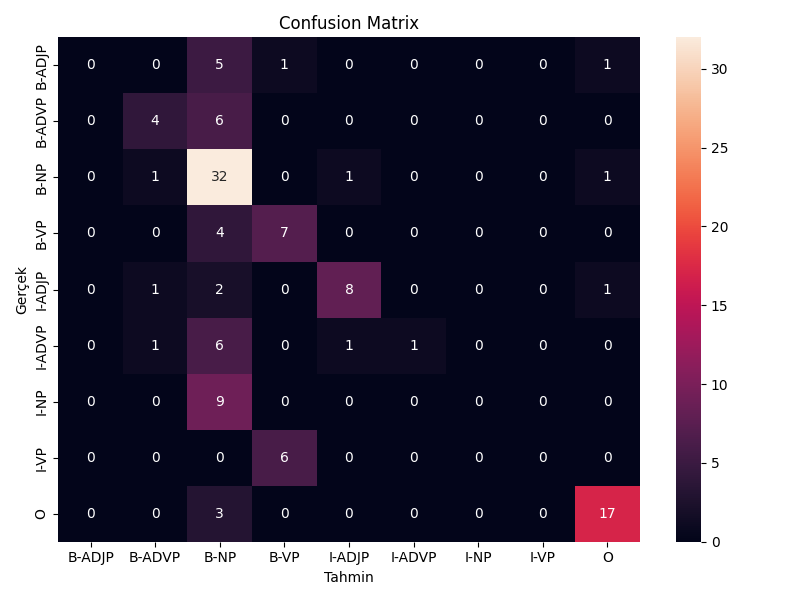

# 🇹🇷 Türkçe NLP Chunking Sistemi

Türkçe metinlerde kelimelerin cümle içerisindeki öbek yapılarını (chunk) otomatik olarak belirlemek amacıyla geliştirilmiş makine öğrenmesi tabanlı bir Doğal Dil İşleme (NLP) projesidir.

Proje, Bursa Teknik Üniversitesi Bilgisayar Mühendisliği Bölümü Doğal Dil İşlemeye Giriş dersi kapsamında geliştirilmiştir.

---

## 📌 Proje Hakkında

Bu projede Türkçe cümlelerdeki kelimelerin ait olduğu sözdizimsel öbeklerin otomatik olarak tahmin edilmesi amaçlanmıştır.

Çalışma kapsamında:

- Türkçe cümlelerden oluşan bir veri seti manuel olarak etiketlendi.
- Veri seti NLP çalışmalarında kullanılan CoNLL formatında oluşturuldu.
- Kelimelerden çeşitli özellikler çıkarılarak makine öğrenmesi için uygun hale getirildi.
- Logistic Regression algoritması kullanılarak bir sınıflandırma modeli eğitildi.
- Modelin performansı Classification Report ve Confusion Matrix ile değerlendirildi.
- Eğitilen model kaydedilerek yeni Türkçe cümleler üzerinde tahmin yapılabilecek hale getirildi.

---

## 📊 Veri Seti

Projede kullanılan veri seti manuel olarak hazırlanmış ve toplam 72 Türkçe cümleden oluşturulmuştur.

Veriler data/train.conll dosyasında CoNLL formatında tutulmaktadır.

Her satır temel olarak:

Kelime    Etiket
yapısındadır.

Kullanılan chunk etiketleri arasında:

- NP — İsim Öbeği
- VP — Fiil Öbeği
- ADJP — Sıfat Öbeği
- ADVP — Zarf Öbeği
- CHUNK-INNER
- CLAUSE

bulunmaktadır.

---

## ⚙️ Özellik Çıkarımı

Modelin kelimeleri yalnızca doğrudan ezberlemesini engellemek ve kelimelerin yapısal/bağlamsal özelliklerinden yararlanmak amacıyla feature engineering uygulanmıştır.

Kullanılan özelliklerden bazıları:

- Kelimenin kendisi
- Kelimenin ilk 2 ve 3 karakteri
- Kelimenin son 2 ve 3 karakteri
- Önceki kelime
- Sonraki kelime

Bu özellikler makine öğrenmesi modelinin kullanabileceği sayısal gösterimlere dönüştürülmüştür.

---

## 🤖 Model

Sınıflandırma algoritması olarak Logistic Regression kullanılmıştır.

Projenin temel makine öğrenmesi akışı:

CoNLL Veri Seti
      ↓
Veri Okuma
      ↓
Feature Engineering
      ↓
HashingVectorizer
      ↓
Train / Test Split
      ↓
Logistic Regression
      ↓
Model Değerlendirme
      ↓
Tahmin
Veri seti eğitim ve test verisi olarak ayrılmış ve model eğitim verisi üzerinde eğitilmiştir.

Eğitilen model model.pkl dosyasına kaydedilerek tekrar kullanılabilir hale getirilmiştir.

---

## 📈 Model Değerlendirmesi

Model performansı aşağıdaki yöntemlerle değerlendirilmiştir:

- Accuracy
- Precision
- Recall
- F1-Score
- Classification Report
- Confusion Matrix

Gerçekleştirilen testlerde model yaklaşık %58 accuracy değerine ulaşmıştır.

Veri setinin sınırlı sayıda cümleden oluşması ve bazı etiketlerin veri setinde diğerlerine göre daha az bulunması model performansını etkileyen temel faktörler olarak değerlendirilmiştir.

### Confusion Matrix

Modelin sınıflandırma performansını incelemek amacıyla oluşturulan confusion matrix:

---

## 🧪 Yeni Cümleler Üzerinde Tahmin

Eğitilen model yalnızca test verisi üzerinde değerlendirilmemiş, aynı zamanda kullanıcı tarafından girilen yeni Türkçe cümlelerin analiz edilmesi için de kullanılabilir hale getirilmiştir.

evaluate.py çalıştırıldığında kullanıcıdan bir Türkçe cümle alınır ve sistem cümledeki kelimeler için chunk etiketi tahmini gerçekleştirir.

---

## 📁 Proje Yapısı

nlp-chunking/
│
├── data/
│   └── train.conll
│
├── train.py
├── evaluate.py
├── model.pkl
├── confusion_matrix.png
└── README.md
### Dosyalar

**train.py**  
Veri setinin okunması, özellik çıkarımı, modelin eğitilmesi ve performans değerlendirmesi işlemlerini gerçekleştirir.

**evaluate.py**  
Kaydedilmiş modeli kullanarak yeni Türkçe cümleler üzerinde tahmin yapılmasını sağlar.

**data/train.conll**  
Manuel olarak etiketlenmiş Türkçe NLP vermodel.pkl*model.pkl**  
Eğitim sonucunda oluşturulan makine öğrenmesi modelini içerir.
**confusion_matrix.png**  
Modelin sınıflandırma sonuçlarının görselleştirilmesini içerir.

---

## 🛠️ Kullanılan Teknolojiler

- Python
- Scikit-learn
- Logistic Regression
- HashingVectorizer
- CoNLL
- NLP (Natural Language Processing)
- Matplotlib
- Pickle

---

## 🎯 Kazanımlar

Bu proje kapsamında:

- NLP için veri seti oluşturma ve manuel annotation
- CoNLL veri formatı ile çalışma
- Feature engineering
- Makine öğrenmesi modeli geliştirme
- Logistic Regression
- Train/Test veri ayrımı
- Model performans değerlendirmesi
- Classification Report ve Confusion Matrix yorumlama
- Eğitilmiş modeli kaydetme ve yeniden kullanma

konularında uygulamalı deneyim kazanılmıştır.

---

## 👩‍💻 Geliştirici İsmihan Kırmızıoğlan**  
Bursa Teknik Üniversitesi  
Bilgisayar Mühendisliği

Bu proje akademik çalışma kapsamında geliştirilmiştir.